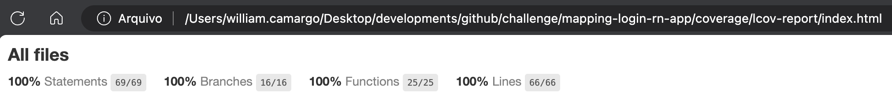

# mapping-login-rn-app

O `mapping-login-rn-app` é o repositório responsável por features de autenticação do MappingApp. É instalado como dependência submódulo do repositório central mapping-core-rn.

### Pendencias

- [ ] adicionar no package "@react-native-google-signin/google-signin": "11.0.0", para login com o google
  - yarn add @react-native-google-signin/google-signin -E
  - Habilitar funções do google na tela de login
  - Habilitar o #import <GoogleSignIn/GoogleSignIn.h> na pasta ios arquivo appdelegate.mm

## Aplicação em tempo real

### Android

### iOS

## Cobertura do código

